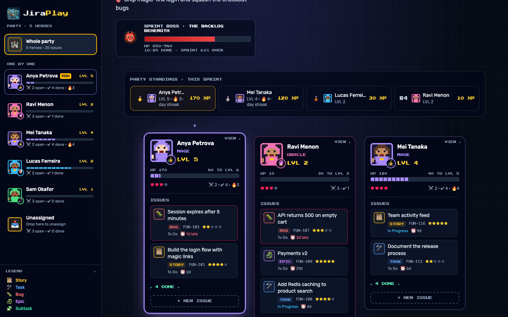
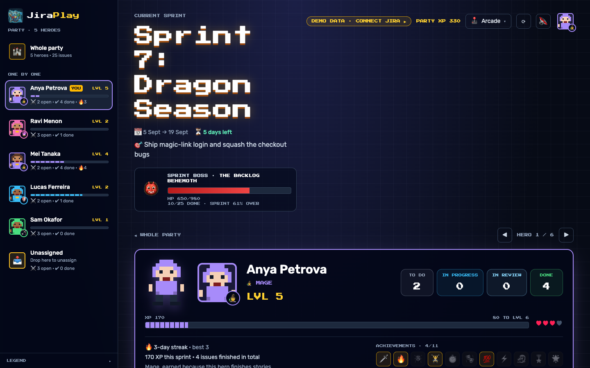
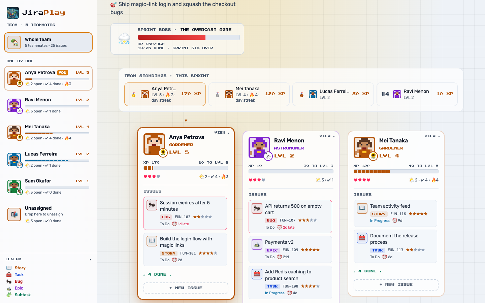

# JiraPlay

Your team's Jira issues as a game. Every teammate is a hero with a level, an XP bar, a streak and hearts that drop for overdue work. The sprint is a boss fight: every finished issue is a hit.

It runs two ways from the same code: as a **VS Code extension** (each person signs in with their own Jira account) or as a **local web app**.

> **Made for fun.** JiraPlay is a playful side project, not a replacement for Jira. It covers a small set of everyday actions (viewing issues, marking them done, changing status, reassigning, commenting and creating simple issues) and leaves everything else to Jira itself. XP, levels, streaks and achievements are just for fun: they aren't a measure of anyone's work, and they're only kept on your computer.



## What's in the game

- **Sprint boss.** The boss's HP is the XP of the sprint's open work. It gets enraged late in the sprint with most of its HP left, and it's defeated when everything is done.
- **XP that sticks.** XP is 10 × story points per finished issue (10 without points). JiraPlay keeps a ledger of finished work, so XP stays after issues leave the board, and goes away if an issue is reopened. Level is `floor(sqrt(XP / 10)) + 1`.
- **Standings.** The party's leaderboard for the current sprint.
- **Streaks.** Days in a row with finished work. Weekends without work don't break a streak.
- **Achievements.** Eleven badges, from First Blood to Legend, earned only from finished work.
- **Earned classes.** After three finished issues, a hero's class follows what they actually do: squash bugs and you're the Rogue, take on epics and you're the Oracle.
- **Level-ups** take over the screen with confetti and a shake (turned off when your system asks for reduced motion).
- **Eight themes:** Arcade, Space Fleet, Heist City, Wizard School, Neon Cyber, Block World, Grand Prix and **Daylight**, a light theme. Each changes colours, fonts, wording, classes, the boss and the sound.



## Working with issues

- **Hero pages** show a teammate's issues in the same columns as your Jira board. Step through heroes with ◀ ▶ or the ← → keys; Esc goes back.
- **Mark done** with an issue's icon. The change shows immediately and waits 5 seconds with **Undo** (or ⌘/Ctrl+Z) before it's sent to Jira, since Jira can't take it back. JiraPlay picks the Done transition that needs no extra fields, prefers your board's last column, then a status called Done.
- **Change status** from an issue's Status menu, which lists the moves your workflow allows.
- **Reassign** by dragging an issue onto a hero, or with the **Assign** menu inside the issue (works with the keyboard and screen readers).
- **Comments:** read the latest 50 and add your own (⌘/Ctrl+Enter posts).
- **Your profile** (your avatar, top right): your level, achievements and a searchable list of your issues on the board or across all of Jira.
- **New issue** with "+ New issue" (needs a project key). It only stays on the board if it matches your JQL.

If a change fails, the board puts the issue back and tells you why. Boards over 1,000 issues show the first 1,000 and say so.



## VS Code extension

**Install**

```bash
npm install
npm run package      # creates jiraplay-<version>.vsix
```

Then in VS Code: Extensions view → `…` menu → **Install from VSIX…** and pick the file.

**Use**

The first start opens the board with a **Connect Jira** guide, and **Help → Get Started** has a JiraPlay walkthrough. You need:

1. Your Jira site (e.g. `your-team.atlassian.net`) and the email you log into Jira with.
2. An [API token](https://id.atlassian.com/manage-profile/security/api-tokens): click **Create API token** (not "with scopes").
3. Your project key (the `ABC` in `ABC-123`) and whether your team uses sprints, or your own JQL.

JiraPlay checks the login and the JQL with Jira before saving anything.

- The **JiraPlay sidebar** shows your level, streak, open issues (click one to open it on the board), the sprint boss and the standings.
- The status bar shows `⚔ LVL 3 · 7 open · 🔥4`.
- **JiraPlay: Sign in to Jira** reopens the guide; **JiraPlay: Sign out of Jira** removes your token.
- An open board comes back after VS Code restarts.

Without signing in, the board shows demo data.

**Settings** (Settings → JiraPlay)

| Setting | What it does |
| --- | --- |
| `jiraPlay.theme` | The board's theme. |
| `jiraPlay.projectKey`, `jiraPlay.issueType` | Where "+ New issue" creates issues. |
| `jiraPlay.boardId` | The Jira board whose columns to show (the number in its URL). Empty finds your project's board. |
| `jiraPlay.pointsField`, `jiraPlay.sprintField` | Custom field ids. Empty finds them on your site. |
| `jiraPlay.allowedHosts` | Extra hosts your token may go to, for a Jira Cloud custom domain. |

## Web app

```bash
npm install
npm run dev        # http://localhost:5173
```

With no `.env` it starts on demo data and opens the same **Connect Jira** guide, which saves your details to `.env` in this folder. You can also copy `.env.example` to `.env` and fill it in by hand. XP history is kept in `.jiraplay-ledger.json`.

## Security

- **Your token only goes to Atlassian.** JiraPlay sends it only over https to `*.atlassian.net` or `*.jira.com` (plus any hosts you list in `jiraPlay.allowedHosts` / `JIRA_ALLOWED_HOSTS`), and never follows redirects with it. In VS Code the site and email are user-only settings, so a workspace's settings can't point your token elsewhere.
- **VS Code** keeps the token in the system keychain. The board runs under a strict Content Security Policy: bundled scripts, styles and fonts only, and images only from Atlassian and Gravatar.
- **The web app** listens on 127.0.0.1 and answers only requests addressed to `localhost` from local pages, which blocks DNS rebinding and other websites. `.env` and the XP ledger are written atomically and readable only by you.

## Development

```bash
npm run check      # typecheck, lint and tests
npm run test       # Vitest
npm run lint       # oxlint, including import boundaries between src/, shared/, server/ and extension/
```

See [CLAUDE.md](CLAUDE.md) for the architecture.

## License

[MIT](LICENSE) © 2026 Jayesh Karande
